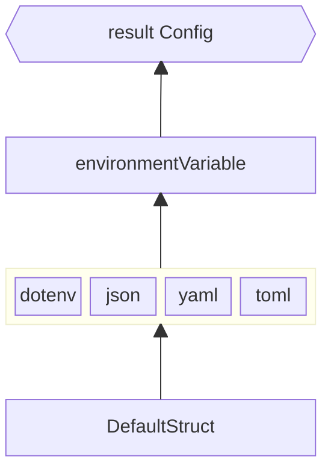

# configer

For cloud native applications, config files could be managed differently than traditional On-Premise applications. Environment variable contains secrets is managed by other cloud service (AWS Parameter Store, AppConfig, Secret Manager for AWS), rather than embedded dotfiles.

For projects with minimum amount of environment variables, set and manage in AWS ECS task definition or AWS Lambda environment variables is enough. But as the config items grows, it becomes harder and harder to manage changes.

And another thing for AWS Lambda, it does not support Parameter Store natively as the time writing.

